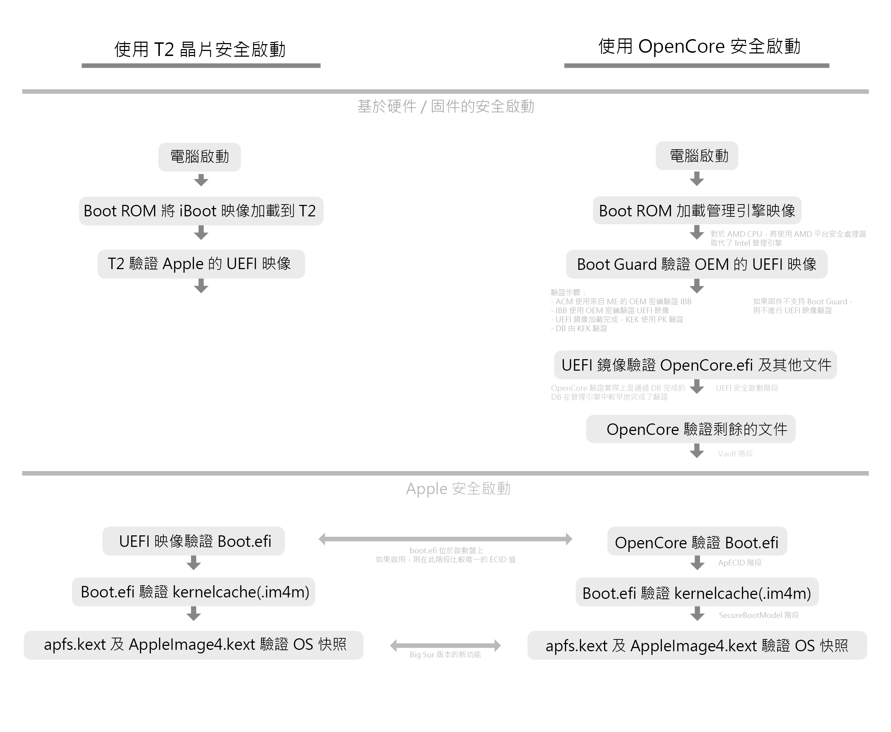

# Apple 安全啟動

1. Apple 安全啟動 並不等同 UEFI 安全啟動。
2. `DmgLoading`, `SecureBootModel`及 `ApECID` 需要 OpenCore 0.6.1 或更新的版本。
3. macOS Big Sur 需要 OpenCore 0.6.3 或更新的版本以取得對 Apple 安全啟動的正確支持。

### 甚麼是 Apple 安全啟動

為了更好地理解 Apple 安全啟動，讓我們來看看啟動過程在 Mac 與 OpenCore 中的安全性方面的工作原理：



正如我們所見，Apple Secure Boot 中包含了多個信任層：

* OpenCore 將驗證 boot.efi 清單（例如 boot.efi.j137ap.im4m）以確保 boot.efi 由 Apple 簽名並且可以被此安全啟動模型使用。
  * 對於非零的 ApECID 值，OpenCore 將額外驗證寫入 boot.efi 清單（例如 boot.efi.j137ap.XXXXXXXX.im4m）中的 ECID 值，以確保來自不同機器的受損硬盤具有相同的安全啟動模式不能在您的計算機上使用。
* boot.efi 將驗證 kernelcache 以確保它沒有被篡改
* apfs.kext 和 AppleImage4 確保您的系統卷的快照未被篡改（僅適用於 Big Sur 或更新的版本）

### SecureBootModel

`SecureBootModel` 用於設置 Apple 安全啟動硬件模型和策略，允許我們使用任何 SMBIOS 啟用 Apple 的安全啟動，即使原始 SMBIOS 不支持它（即 2017 年之前的 SMBIOS 上不存在 T2）。 啟用 `SecureBootModel` 相當於[中等安全性](https://support.apple.com/HT208330) 。

Misc -&gt; Security -&gt; SecureBootModel 目前支持的選項：

| 值 | SMBIOS | 最低 macOS 版本 |
| :--- | :--- | :--- |
| Disabled | 無型號，安全啟動將被禁用。 | N/A |
| Default | 當前設置為 j137、iMacPro1,1 | 10.13.2 \(17C2111\) |
| j137 | iMacPro1,1 \(December 2017\) | 10.13.2 \(17C2111\) |
| j680 | MacBookPro15,1 \(July 2018\) | 10.13.6 \(17G2112\) |
| j132 | MacBookPro15,2 \(July 2018\) | 10.13.6 \(17G2112\) |
| j174 | Macmini8,1 \(October 2018\) | 10.14 \(18A2063\) |
| j140k | MacBookAir8,1 \(October 2018\) | 10.14.1 \(18B2084\) |
| j780 | MacBookPro15,3 \(May 2019\) | 10.14.5 \(18F132\) |
| j213 | MacBookPro15,4 \(July 2019\) | 10.14.5 \(18F2058\) |
| j140a | MacBookAir8,2 \(July 2019\) | 10.14.5 \(18F2058\) |
| j152f | MacBookPro16,1 \(November 2019\) | 10.15.1 \(19B2093\) |
| j160 | MacPro7,1 \(December 2019\) | 10.15.1 \(19B88\) |
| j230k | MacBookAir9,1 \(March 2020\) | 10.15.3 \(19D2064\) |
| j214k | MacBookPro16,2 \(May 2020\) | 10.15.4 \(19E2269\) |
| j223 | MacBookPro16,3 \(May 2020\) | 10.15.4 \(19E2265\) |
| j215 | MacBookPro16,4 \(June 2020\) | 10.15.5 \(19F96\) |
| j185 | iMac20,1 \(August 2020\) | 10.15.6 \(19G2005\) |
| j185f | iMac20,2 \(August 2020\) | 10.15.6 \(19G2005\) |
| x86legacy | Non-T2 Macs in 11.0 \(Recommended for VMs\) | 11.0.0 |

#### SecureBootModel 的特別說明

* 通常 `Default`足夠使用，但是如果您打算將它與 ApECID 一起使用以實現完全安全，我們建議設置一個適當的值（即最接近您計劃啟動的 SMBIOS 或 macOS 版本），因為默認值很可能將來會更新。 
  * 沒有 T2 的普通 Mac 型號不需要 `x86legacy`，支持上述任何值。 
* 緩存驅動程序列表可能不同，導致需要更改添加或強制內核驅動程序列表。 
  * 換句話說，在這種情況下無法注入 IO80211Family，因為它已經存在於內核緩存中
* 無法使用未簽名和多個簽名的內核驅動程序
  * 這包括 10.13 中的 Nvidia 驅動程序
* 帶有密封性的操作系統（如 macOS 11）上的系統音量更改可能會導致操作系統無法啟動。
  *  如果您打算禁用 macOS 的 APFS 快照，請記得同時禁用 `SecureBootModel`
* 啟用之前不需要的安全啟動更有可能觸發某些啟動錯誤
  * 常見於某些 APTIO IV 系統，它們最初可能不需要 IgnoreInvalidFlexRatio 和 HashServices，但安全啟動需要。 
* 在較舊的 CPU 上（即 Sandy Bridge 之前）啟用 Apple 安全啟動可能會導致加載速度稍慢，最多 1 秒 
* 在 Apple Secure Boot 登陸之前發布的操作系統（即 macOS 10.12 或更早版本）仍將啟動，直到啟用 UEFI Secure Boot。
  * 這是因為 Apple Secure Boot 假設它們不兼容並且將像 Microsoft Windows 一樣由固件處理
* 虛擬機將希望使用 `x86legacy` 來支持安全啟動
  * 請注意，使用任何其他模型都需要啟用 `ForceSecureBootScheme`

#### 故障排除

由於 Apple 終端的一個煩人的錯誤，某些系統可能會丟失驅動器上的安全啟動文件本身。因此，您可能會遇到以下問題：

```text
OCB: LoadImage failed - Security Violation
```

請在 macOS 中運行以下命令以解決以上問題：

```bash
# 首先，找到您的 Preboot 分區
diskutil list

# 從下面的列表中，我們可以看到我們的 Preboot 卷是 disk5s2 
/dev/disk5 (synthesized):
   #:                       TYPE NAME                    SIZE       IDENTIFIER
   0:      APFS Container Scheme -                      +255.7 GB   disk5
                                 Physical Store disk4s2
   1:                APFS Volume ⁨Big Sur HD - Data⁩       122.5 GB   disk5s1
   2:                APFS Volume ⁨Preboot⁩                 309.4 MB   disk5s2
   3:                APFS Volume ⁨Recovery⁩                887.8 MB   disk5s3
   4:                APFS Volume ⁨VM⁩                      1.1 MB     disk5s4
   5:                APFS Volume ⁨Big Sur HD⁩              16.2 GB    disk5s5
   6:              APFS Snapshot ⁨com.apple.os.update-...⁩ 16.2 GB    disk5s5s
   
# 現在掛載 Preboot 分區
diskutil mount disk5s2

# CD 進入你的 Preboot 分區
# 注意實際分區在 macOS 中的 /System/Volumes/Preboot 下
# 但是在恢復模式中它只是在 /Volumes/Preboot 下 
cd /System/Volumes/Preboot

# 獲取你的 UUID
ls
 46923F6E-968E-46E9-AC6D-9E6141DF52FD
 CD844C38-1A25-48D5-9388-5D62AA46CFB8
 
# 如果出現多個（即你雙啟動多個版本的 macOS），你會
# 需要確定哪個 UUID 是正確的。
# 最簡單的確定方法是打印每個分區 .disk_label.contentDetails 的值

cat ./46923F6E-968E-46E9-AC6D-9E6141DF52FD/System/Library/CoreServices/.disk_label.contentDetails
 Big Sur HD%

cat ./CD844C38-1A25-48D5-9388-5D62AA46CFB8/System/Library/CoreServices/.disk_label.contentDetails
 Catalina HD%
 
# 接下來讓我們複製安全啟動文件，恢復將需要不同的命令

# macOS 內部的示例命令
# 將 CD844C38-1A25-48D5-9388-5D62AA46CFB8 替換為您的 UUID 值 
cd ~
sudo cp -a /usr/standalone/i386/. /System/Volumes/Preboot/CD844C38-1A25-48D5-9388-5D62AA46CFB8/System/Library/CoreServices

# 恢復命令示例
# 將 Macintosh\ HD 和 CD844C38-1A25-48D5-9388-5D62AA46CFB8 替換為
# 您的系統卷的名稱和 Preboot 的 UUID 
cp -a /Volumes/Macintosh\ HD/usr/standalone/i386/. /Volumes/Preboot/CD844C38-1A25-48D5-9388-5D62AA46CFB8/System/Library/CoreServices
```

現在您可以啟用 `SecureBootModel` 並毫無問題地重新啟動！ 由於我們不是在編輯系統卷本身，因此我們無需擔心禁用 SIP 或破壞 macOS 快照。

### ApECID

ApECID 用作 Apple Enclave 標識符，這意味著它允許我們使用個性化的 Apple 安全啟動標識符並根據 Apple 的安全啟動頁面（與 SecureBootModel 配對時）實現[完全安全](https://support.apple.com/HT208198)。

要生成您自己的 ApECID 值，您需要某種形式的加密安全隨機數生成器，該生成器將輸出 64 位整數。 下面我們提供一個示例，如果您的機器上安裝了 [Python 3](https://www.python.org/downloads/macos/)，則可以運行該示例：

```python
python3 -c 'import secrets; print(secrets.randbits(64))'
```

使用這個獨特的 64 位 int，您現在可以在 config.plist 中的 Misc -&gt; ApECID 下輸入它

但是在設置 ApECID 之前，我們需要注意以下幾點：

* 將 ApECID 設置為非零值時，將需要重新安裝全新的系統適並需要在安裝時進行網絡連接以進行驗證
* `SecureBootModel`應該有一個定義的值而不是 `Default` 以避免在以後的 OpenCore 版本中更改該值時出現問題。
* 預先存在的安裝需要對捲進行個性化設置，為此您需要先重新啟動進入恢復狀態並運行以下命令（將 Macintosh HD 替換為您系統的捲名）：

```bash
# 設置 ApECID 值後運行此命令
# 你還需要一個網絡連接來運行這個命令 
 bless bless --folder "/Volumes/Macintosh HD/System/Library/CoreServices" \
    --bootefi --personalize
```

重新安裝 macOS 10.15 或更早版本時需要注意的是，您可能會收到“無法驗證 macOS”錯誤消息。 要解決此問題，您需要在開始安裝之前在 macOS 恢復終端中輸入以下命令，為 macOS 個性化分配一個 2 MB 的專用 RAM 磁盤：

```bash
disk=$(hdiutil attach -nomount ram://4096)
diskutil erasevolume HFS+ SecureBoot $disk
diskutil unmount $disk
mkdir /var/tmp/OSPersonalizationTemp
diskutil mount -mountpoint /var/tmp/OSPersonalizationTemp $disk
```

