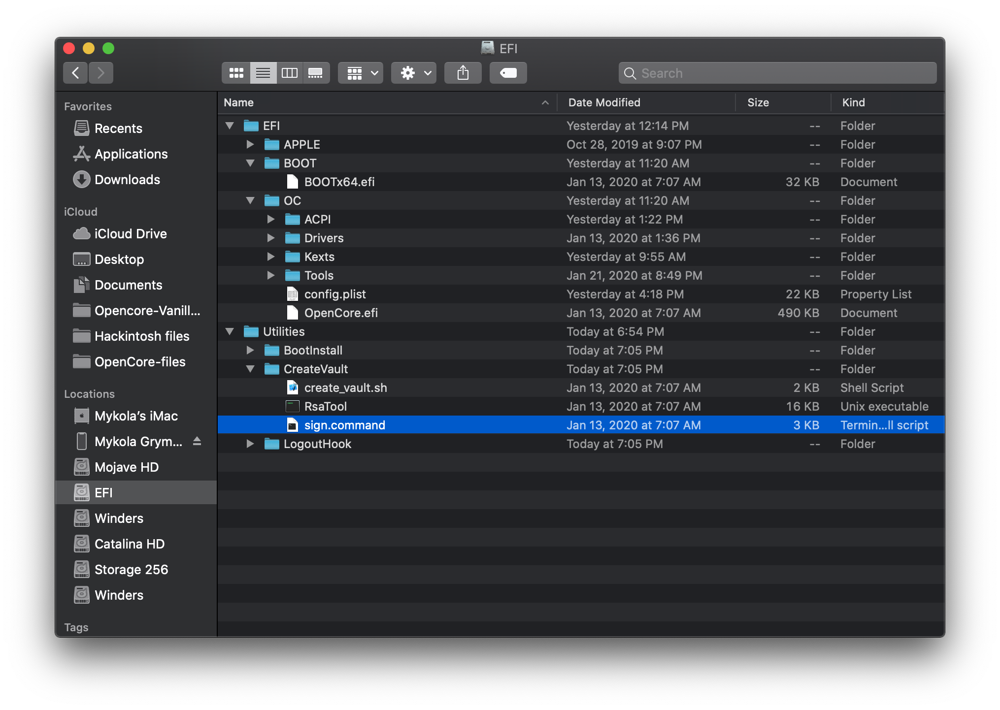
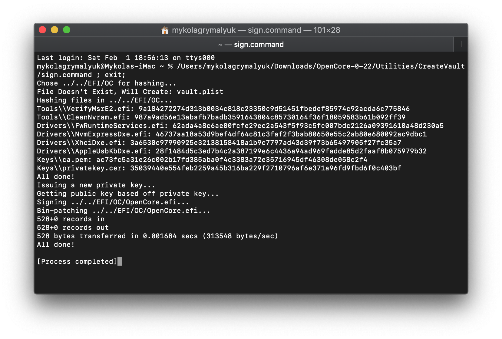

# Vaulting

目前已知 Vaulting 與 UEFI SecureBoot 衝突。

### 什麼是 Vaulting？

好的 Vaulting 基於兩件事，vault.plist 和 vault.sig：

* vault.plist：EFI 的快照
* vault.sig: vault.plist 的驗證

這可以看作是 OpenCore 的安全啟動，因此任何人都不能在未經您許可的情況下對其進行修改和進入。

Vaulting 的具體內容是 vault.plist 的 256 字節 RSA-2048 簽名將被推送到我們的 OpenCore.efi 中。如果您已經編譯了 OpenCore.efi，則可以在編譯之前將此密鑰推送到 OpenCoreVault.c 中，或者使用 sign.command。

Vaulting 的具體情況是，vault.plist 的 256 字節 RSA-2048 簽名將被推送到我們的 OpenCore.efi。如果你已經編譯了 OpenCore.efi， 則可以用 sign.command。

請注意，nvram.plist 不會被 Vault，因此使用模擬 NVRAM 的用戶仍然存在有人添加/刪除某些 NVRAM 變量的風險

config.plist 中的設置：

*  `Misc -> Security -> Vault`:
  * `Basic`: 只需要 vault.plist 存在，主要用於文件系統完整性驗證
  * `Secure`: 需要 vault.plist 和 vault.sig，用於最佳安全性，因為 vault.plist 更改需要新簽名
* `Booter -> ProtectSecureBoot:` `YES`
  * Insyde 固件需要用於修復安全啟動密鑰和報告違規

下載 OpenCorePkg 並打開 `CreateVault` 文件夾，在裡面我們會找到以下內容：

* `craete_vault.sh`
* `RsaTool`
* `sign.command`

最後一個是我們需要的：`sign.command`

因此，當我們運行此命令時，它會查找位於 Utilities 文件夾旁邊的 EFI 文件夾，因此我們希望將我們的個人 EFI 放入 OpenCorePkg 文件夾或將 Utilities 放入我們的 EFI 文件夾：

現在我們準備好運行 `sign.command`：

設置後禁用 Vault：

如果您正在執行繁重的故障排除或需要禁用 Vault，則需要更改的主要內容：

* 獲取 新的 OpenCore.efi
* `Misc -> Security -> Vault`設置為 Optional
* 刪除 `vault.plist`和 `vault.sig`

