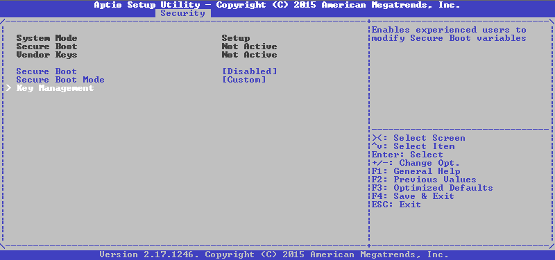
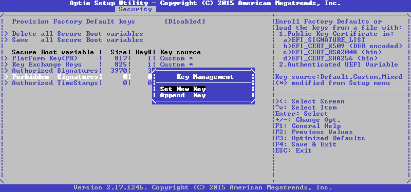
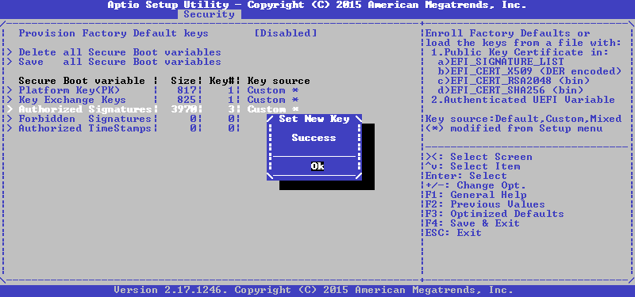
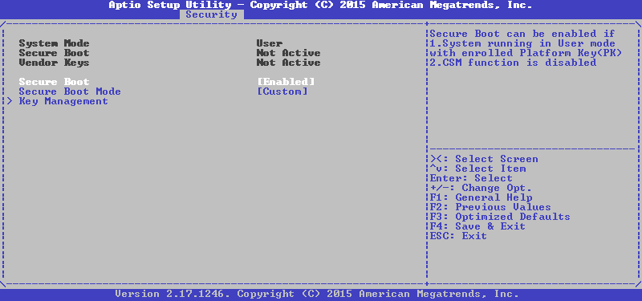

# 安裝密鑰 - AMI AptioV

準備一隻容量大於 200 MB 的 USB，並格式化為 FAT32。

1. 將 `KeyTool-signed.efi` 放入 USB `/EFI/BOOT` 並重新命名為 `BOOTX64.efi`
2. 將 `DB.auth` `KEK.auth` `PK.auth` 放入 USB 根目錄
3. 重新啟動並進入 UEFI

## **AMI AptioV**

對於大多數基於 AMI 代碼的固件，SecureBoot 管理位於 “Security” 選項，如下所示：

1.進入 "Key Management"

2. 選擇我們需要的變量

3. 選擇 "Set New Key"

4. 選擇 "Authenticated Variable"

5. 你需要確認文件的更新，如果之前一切順利，結果將是一條簡明的信息

6. 對 KEK 和 PK 重複相同的操作

7. 用 Esc 鍵返回上一級菜單，啟用 SecureBoot

8. 添加密鑰並重新啟動後，嘗試重新啟動`KeyTool-signed.efi`確定 SecureBoot 正確運作

