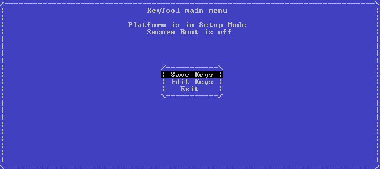
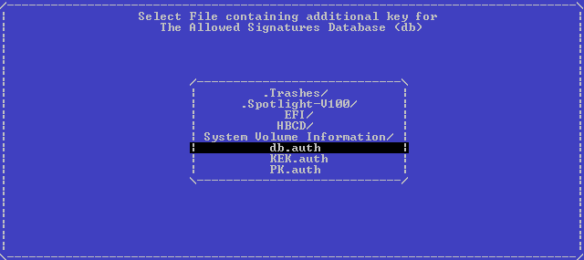

# 安裝密鑰 - Phoenix SCT

準備一隻容量大於 200 MB 的 USB，並格式化為 FAT32。

1. 將 `KeyTool-signed.efi` 放入 USB `/EFI/BOOT` 並重新命名為 `BOOTX64.efi`
2. 將 `DB.auth` `KEK.auth` `PK.auth` 放入 USB 根目錄
3. 重新啟動並進入 UEFI

## Phoenix SCT

1.選擇 "Change to Customized Signature"

2. 然後，在 Boot 選項上，需要選擇 UEFI 引導，啟用SecureBoot，並為 KeyTool 創建引導記錄，否則將無法運行

3. 單擊是，退出並保存更改，重新啟動，加載時按 F12 進入啟動菜單，從那裡選擇 KeyTool

4. 從 USB 啟動 KeyTool

5. 選擇 "Edit Keys"

6. 首先選擇 db，然後選擇 "Replace Keys"，然後選擇 USB 設備

7. 選擇 `DB.auth`

8. 對 KEK 及 PK 重複相同的操作

9. 添加密鑰並重新啟動後，嘗試重新啟動`KeyTool-signed.efi`確定 SecureBoot 正確運作

